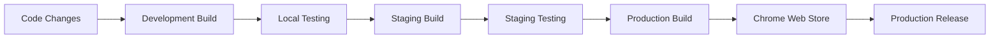

# Chrome Extension Multi-Environment Deployment Guide

This guide covers deploying the Applying Myself Chrome extension across development, staging, and production environments.

## 🏗️ Environment Configuration

### Development Environment
- **Convex URL**: `https://dazzling-badger-1.convex.cloud`
- **Web App URL**: `http://localhost:3000`
- **Manifest**: `src/manifest.dev.json`
- **Features**: Hot reload, detailed logging, development tools

### Staging Environment
- **Convex URL**: `https://staging-deployment.convex.cloud` (to be created)
- **Web App URL**: `https://dev.applyingmyself.com`
- **Manifest**: `src/manifest.staging.json`
- **Features**: Production build, staging banner, limited logging

### Production Environment
- **Convex URL**: `https://oceanic-retriever-344.convex.site`
- **Web App URL**: `https://applyingmyself.com`
- **Manifest**: `src/manifest.prod.json`
- **Features**: Optimized build, no banners, minimal logging

## 🚀 Building for Different Environments

### Quick Commands

```bash
# Development build (with hot reload)
npm run build:dev

# Staging build
npm run build:staging

# Production build
npm run build:prod

# Create deployment packages
npm run zip:staging
npm run zip:prod

# Use deployment script (recommended)
npm run deploy staging --zip
npm run deploy production --clean --zip
```

### Deployment Script Usage

The `npm run deploy` script provides a comprehensive build and package solution:

```bash
# Build for staging with zip package
npm run deploy staging --zip

# Build for production with clean and zip
npm run deploy production --clean --zip

# Development build (no zip needed)
npm run deploy development

# Get help
npm run deploy --help
```

## 📦 Environment-Specific Features

### Manifest Differences

| Feature | Development | Staging | Production |
|---------|-------------|---------|------------|
| Name | "Applying Myself - Development" | "Applying Myself - Staging" | "Applying Myself" |
| Host Permissions | `*.convex.cloud/*` | `*.convex.cloud/*`, `dev.applyingmyself.com/*` | `*.convex.site/*`, `applyingmyself.com/*` |
| Hot Reload | ✅ Enabled | ❌ Disabled | ❌ Disabled |
| Version Suffix | Timestamp added | Static | Static |

### Configuration Differences

```typescript
// Development
{
  CONVEX_URL: 'https://dazzling-badger-1.convex.cloud',
  SITE_URL: 'http://localhost:3000',
  ENVIRONMENT: 'development'
}

// Staging
{
  CONVEX_URL: 'https://staging-deployment.convex.cloud',
  SITE_URL: 'https://dev.applyingmyself.com',
  ENVIRONMENT: 'staging'
}

// Production
{
  CONVEX_URL: 'https://oceanic-retriever-344.convex.site',
  SITE_URL: 'https://applyingmyself.com',
  ENVIRONMENT: 'production'
}
```

## 🔧 Setup Instructions

### 1. Development Setup

```bash
# Install dependencies
npm install

# Generate API types
npm run generate-api

# Start development server
npm run dev

# Or build for development
npm run build:dev
```

**Loading in Chrome:**
1. Open `chrome://extensions/`
2. Enable "Developer mode"
3. Click "Load unpacked"
4. Select the `dist/` folder
5. Extension will auto-reload on changes

### 2. Staging Deployment

```bash
# Build staging package
npm run deploy staging --zip

# Upload extension-staging.zip to Chrome Web Store (staging track)
```

**Prerequisites:**
- Staging Convex deployment must be created
- `dev.applyingmyself.com` must be accessible

### 3. Production Deployment

```bash
# Build production package
npm run deploy production --clean --zip

# Upload extension-production.zip to Chrome Web Store
```

**Prerequisites:**
- Production Convex deployment (`oceanic-retriever-344.convex.site`)
- `applyingmyself.com` live and accessible

## 🔐 Environment Variables & Secrets

### Authentication Configuration

The extension uses Convex's built-in authentication system. No additional OAuth setup is required.

### Convex Environment Setup

Each environment connects to a different Convex deployment:

1. **Development**: Already configured (`dazzling-badger-1.convex.cloud`)
2. **Staging**: Needs to be created
3. **Production**: Already configured (`oceanic-retriever-344.convex.site`)

## 🎨 Visual Environment Indicators

The extension includes environment banners for non-production builds:

- **Development**: 🟡 Amber banner "DEVELOPMENT ENVIRONMENT"
- **Staging**: 🔵 Blue banner "STAGING ENVIRONMENT"  
- **Production**: No banner (clean interface)

## 📋 Pre-Deployment Checklist

### Before Staging Release
- [ ] Staging Convex deployment created and configured
- [ ] `dev.applyingmyself.com` accessible and working
- [ ] Extension tested with staging backend
- [ ] Environment banner displays correctly

### Before Production Release
- [ ] Production Convex deployment verified
- [ ] `applyingmyself.com` live and accessible
- [ ] All features tested in production environment
- [ ] No environment banners visible
- [ ] Performance optimizations verified

## 🚨 Troubleshooting

### Common Issues

1. **"Cannot connect to Convex"**
   - Verify CONVEX_URL in config matches environment
   - Check host_permissions in manifest includes Convex domain

2. **"Authentication failed"**
   - Verify Convex authentication is working
   - Check that user sessions persist correctly

3. **"Extension not loading"**
   - Verify manifest.json syntax is valid
   - Check all required permissions are included
   - Ensure all files referenced in manifest exist

### Debug Commands

```bash
# Check configuration
npm run check-config

# Verify build output
ls -la dist/

# Test manifest validity
cat dist/manifest.json | jq .

# Check environment detection
npm run deploy development
```

## 📊 Deployment Workflow



## 🔄 Maintenance

### Regular Tasks
- Update API types: `npm run generate-api`
- Rebuild icons: `npm run generate-icons`
- Clean builds: `npm run clean`
- Update dependencies: `npm update`

### Environment Sync
- Keep Convex schemas in sync across environments
- Monitor environment-specific error rates
- Test cross-environment compatibility

This multi-environment setup ensures reliable deployment across development, staging, and production while maintaining proper isolation and configuration management. 