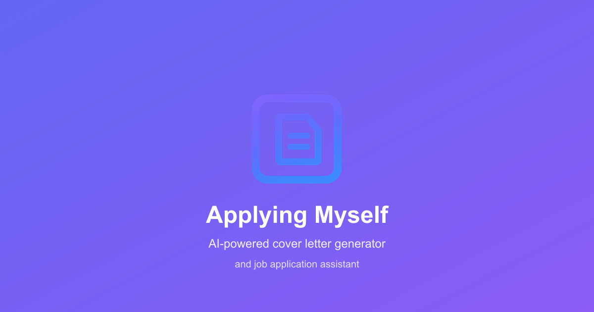
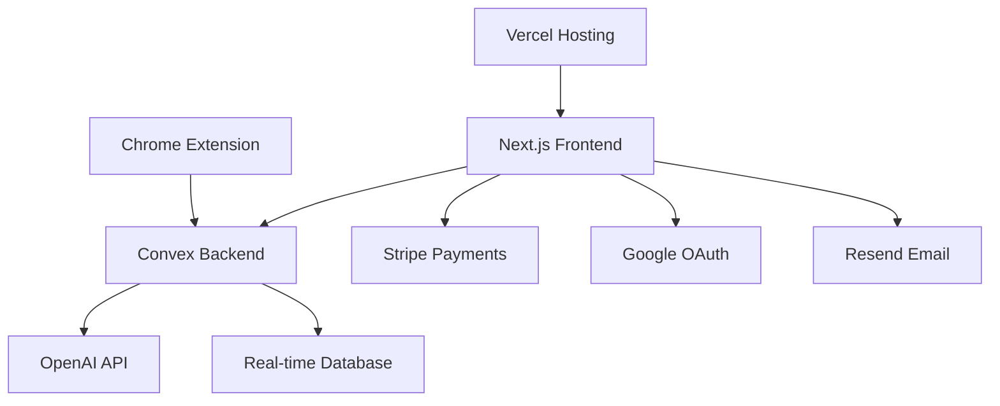

<div align="center">

# 🚀 Applying Myself - AI Cover Letter Generator

[](https://nextjs.org/)
[](https://www.typescriptlang.org/)
[](https://tailwindcss.com/)
[](https://convex.dev/)
[](https://vercel.com/)


### ✨ Generate personalized, professional cover letters in seconds with AI

**Transform your job search with AI-powered cover letters that get you hired**

[](https://applyingmyself.com)
[](https://dev.applyingmyself.com)

</div>

---

## 📊 Project Stats

<div align="center">

| Metric | Value |
|--------|-------|
| 🎯 **Cover Letters Generated** | 2.5M+ |
| 📈 **Success Rate** | 89% |
| ⚡ **Average Generation Time** | 30 seconds |
| 🎉 **Monthly Placements** | 70+ |

</div>

---

## 🎨 Features & Screenshots

### 🏠 **Modern Landing Page**


### ⚡ **Key Features**
- 🤖 **AI-Powered Generation** - Advanced AI analyzes job descriptions and creates personalized cover letters
- 📄 **Resume Upload & Analysis** - Upload your resume for intelligent content matching
- 💼 **Job Description Integration** - Paste any job posting for targeted applications
- 📊 **Application Tracking** - Monitor your job applications and success rate
- 💳 **Flexible Billing** - Pay-per-use or subscription plans
- 🔐 **Secure Authentication** - Google OAuth and email verification
- 📱 **Chrome Extension** - Apply directly from job boards
- 🎯 **Success Analytics** - Track your application performance

---

## 🛠️ Tech Stack

<div align="center">

### Frontend


### Backend & Infrastructure


### AI & APIs


</div>

---

## 🚀 Quick Start

### Prerequisites
- **Node.js** 18+ and npm
- **Convex Account** - [Sign up here](https://convex.dev)
- **Environment Variables** - See [Environment Setup](#-environment-setup)

### 1. Clone & Install
```bash
git clone https://github.com/yourusername/applying-myself.git
cd applying-myself/applying-myself-next
npm install
```

### 2. Environment Setup
Create `.env.local` in the project root:

```bash
# 🔗 Convex Configuration
NEXT_PUBLIC_CONVEX_URL=https://your-deployment.convex.cloud
CONVEX_DEPLOY_KEY=your-convex-deploy-key

# 🌐 Site Configuration  
NEXT_PUBLIC_SITE_URL=http://localhost:3000
NEXT_PUBLIC_ENVIRONMENT=development

# 🔐 Google OAuth
NEXT_PUBLIC_GOOGLE_CLIENT_ID=your-google-client-id
GOOGLE_CLIENT_SECRET=your-google-client-secret

# 💳 Stripe (Test Mode)
NEXT_PUBLIC_STRIPE_PUBLISHABLE_KEY=pk_test_...
STRIPE_SECRET_KEY=sk_test_...
STRIPE_WEBHOOK_SECRET=whsec_...

# 📧 Email (Resend)
RESEND_API_KEY=your-resend-api-key
FROM_EMAIL=dev@yourdomain.com
```

### 3. Start Development
```bash
npm run dev
```

Visit [https://localhost:3000](https://localhost:3000) 🚀

---

## 📁 Project Structure

```
applying-myself-next/
├── 📱 app/                    # Next.js App Router
│   ├── 🏠 page.tsx           # Landing page
│   ├── 🔐 login/             # Authentication
│   ├── 📊 dashboard/         # User dashboard
│   │   ├── 📄 cover-letters/ # Cover letter management
│   │   ├── 💼 jobs/          # Job applications
│   │   ├── 📄 resumes/       # Resume management
│   │   ├── 💳 billing/       # Subscription & billing
│   │   └── ⚙️ settings/      # User settings
│   └── 🔌 api/               # API routes
├── 🧩 components/            # Reusable UI components
├── 🎨 public/               # Static assets
│   ├── 🎯 logo.png          # Main logo
│   ├── 📱 icons/            # App icons
│   └── 🖼️ og-image.png      # Social sharing image
├── 🛠️ utils/                # Utility functions
├── 📝 convex/               # Convex backend integration
└── 📋 scripts/              # Build & utility scripts
```

---

## 🎯 Available Scripts

| Command | Description |
|---------|-------------|
| `npm run dev` | 🔥 Start development server with HTTPS |
| `npm run build` | 🏗️ Build for production |
| `npm run start` | ▶️ Start production server |
| `npm run lint` | 🔍 Run ESLint |
| `npm run generate-api` | 🔄 Generate Convex API types |
| `npm run dev:staging` | 🧪 Start staging development |
| `npm run deploy:staging` | 🚀 Deploy to staging |
| `npm run deploy:production` | 🚀 Deploy to production |

---

## 🌍 Multi-Environment Setup

This project supports three environments with complete isolation:

### 🏠 Local Development
- **URL**: `https://localhost:3000`
- **Convex**: `dazzling-badger-1.convex.cloud`
- **Mode**: Development with hot reload

### 🧪 Staging Environment  
- **URL**: `https://dev.applyingmyself.com`
- **Convex**: Staging deployment
- **Mode**: Production build, test data

### 🚀 Production Environment
- **URL**: `https://applyingmyself.com`  
- **Convex**: `oceanic-retriever-344.convex.site`
- **Mode**: Live production

> 📚 **Detailed Setup Guide**: See [DEV_STAGING_SETUP.md](../DEV_STAGING_SETUP.md) for complete multi-environment configuration.

---

## 🏗️ Architecture Overview



### 🔄 Data Flow
1. **User Authentication** → Google OAuth → Convex Auth
2. **Resume Upload** → File Processing → AI Analysis  
3. **Job Description** → Content Analysis → AI Matching
4. **Cover Letter Generation** → OpenAI API → Personalized Output
5. **Application Tracking** → Real-time Updates → Dashboard Analytics

---

## 💳 Pricing & Credits System

| Plan | Price | Credits | Features |
|------|-------|---------|----------|
| **Starter** | Free | 5 credits | Basic cover letter generation |
| **Pro** | $19/month | 50 credits | Advanced AI, unlimited resumes |
| **Hired** | $49/month | 200 credits | Priority support, analytics |

### Credit Usage
- 📄 **Resume Upload**: 1 credit
- 🔍 **Job Extraction**: 1 credit  
- ✍️ **Cover Letter**: 3 credits

---

## 🔧 Development

### Code Quality
- **TypeScript** for type safety
- **ESLint** for code linting  
- **Tailwind CSS** for styling
- **Component-based architecture**

### Performance Optimizations
- ⚡ **Turbopack** for fast builds
- 🖼️ **Next.js Image Optimization**
- 📦 **Automatic code splitting**
- 🎯 **SEO optimized** with metadata

### Security Features
- 🔐 **OAuth 2.0** authentication
- 🛡️ **CSRF protection**
- 🔒 **Environment variable validation**
- 🚫 **Rate limiting**

---

## 🤝 Contributing

We welcome contributions! Please see our [Contributing Guidelines](CONTRIBUTING.md).

### Development Setup
1. Fork the repository
2. Create a feature branch: `git checkout -b feature/amazing-feature`
3. Commit changes: `git commit -m 'Add amazing feature'`
4. Push to branch: `git push origin feature/amazing-feature`
5. Open a Pull Request

---

## 📄 Documentation

- 📋 [API Documentation](docs/API.md)
- 🔧 [Environment Setup Guide](../DEV_STAGING_SETUP.md)
- 🔐 [OAuth Configuration](../GOOGLE_OAUTH_SETUP.md)
- 💳 [Stripe Integration](../STRIPE_TESTING_GUIDE.md)
- 🔌 [Chrome Extension](../applying-myself-chrome-extension/README.md)

---

## 📞 Support & Links

<div align="center">

[](https://applyingmyself.com)
[](mailto:hello@applyingmyself.com)
[](https://github.com/yourusername/applying-myself/issues)

### 🌟 Star us on GitHub if this project helped you!

</div>

---

## 📜 License

This project is licensed under the MIT License - see the [LICENSE](LICENSE) file for details.

---

<div align="center">

**Built with ❤️ by the Applying Myself Team**

*Empowering job seekers with AI-powered tools*

[](https://nextjs.org/)
[](https://vercel.com/)
[](https://convex.dev/)

</div>
